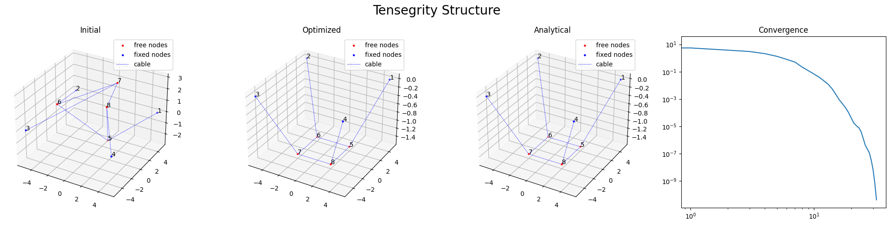

# Tensegrity Structure Optimization

An optimization framework for computing equilibrium configurations of tensegrity structures using energy minimization and quasi-Newton methods. This project implements BFGS optimization with strong Wolfe line search to solve constrained nonlinear programming problems arising in tensegrity mechanics.

## Overview

Tensegrity structures are spatial frameworks composed of cables (tension elements) and bars (compression struts) in equilibrium. These structures exhibit unique mechanical properties due to their prestressed nature, where cables are under tension and bars are under compression without direct contact between compression elements.

This implementation solves the fundamental problem of finding stable equilibrium configurations by minimizing the total potential energy of the system. The project demonstrates optimization of three different tensegrity configurations with increasing complexity, from simple cable-only systems to full cable-strut assemblies with gravitational effects.

## Mathematical Formulation

### Energy Function

The total potential energy of a tensegrity system is formulated as:

$$
E(X) = E_{\text{cable}}(X) + E_{\text{bar}}(X) + E_{\text{external}}(X) + E_{\text{penalty}}(X)
$$

where $X \in \mathbb{R}^{3N}$ represents the concatenated coordinates of $N$ nodes.

#### Cable Energy

Cables only resist tension and have zero elastic energy in compression:

$$
E_{\text{cable}}(X) = \sum_{(i,j) \in \mathcal{E}_c} \frac{k}{2l_{ij}^2} \max(d_{ij} - l_{ij}, 0)^2
$$

where:

- $\mathcal{E}_c$ is the set of cable edges
- $d_{ij} = \|X_i - X_j\|$ is the current distance between nodes $i$ and $j$
- $l_{ij}$ is the rest length of cable $(i,j)$
- $k$ is the cable stiffness parameter

#### Bar Energy

Bars resist both tension and compression with linear elasticity:

$$
E_{\text{bar}}(X) = \sum_{(i,j) \in \mathcal{E}_b} \frac{c}{2l_{ij}^2} (d_{ij} - l_{ij})^2
$$

where $\mathcal{E}_b$ is the set of bar edges and $c$ is the bar stiffness.

#### External Forces

Gravitational potential energy and distributed loads:

$$
E_{\text{external}}(X) = \sum_{i=1}^N m_i g X_{i,z} + \sum_{(i,j) \in \mathcal{E}_b} \frac{\rho g l_{ij}}{2}(X_{i,z} + X_{j,z})
$$

#### Penalty Methods

For handling constraints (ground contact, symmetry):

$$
E_{\text{penalty}}(X) = \frac{\mu}{2} \sum_{i=1}^N \max(0, -X_{i,z})^2 + \frac{\mu_1}{2} \|\mathbf{A}X - \mathbf{b}\|^2
$$

### Optimization Problem

The equilibrium configuration is found by solving:

$$
\min_{X \in \mathbb{R}^{3N}} E(X) \quad \text{subject to} \quad X_{\text{fixed}} = X_0
$$

with gradient:

$$
\nabla E(X) = \nabla E_{\text{cable}}(X) + \nabla E_{\text{bar}}(X) + \nabla E_{\text{external}}(X) + \nabla E_{\text{penalty}}(X)
$$

### BFGS Algorithm

The quasi-Newton BFGS method iteratively updates the Hessian approximation:

$$
B_{k+1} = \left(I - \rho_k s_k y_k^T\right) B_k \left(I - \rho_k y_k s_k^T\right) + \rho_k s_k s_k^T
$$

where $s_k = x_{k+1} - x_k$, $y_k = \nabla f_{k+1} - \nabla f_k$, and $\rho_k = \frac{1}{y_k^T s_k}$.

## Method and Algorithms

### Core Algorithms

1. **BFGS Quasi-Newton Method** (`algorithm.py`):

   - Approximates the Hessian using gradient information
   - Ensures superlinear convergence near the optimum
   - Maintains positive definiteness of the Hessian approximation
2. **Strong Wolfe Line Search** (`algorithm.py`):

   - Ensures sufficient decrease (Armijo condition): $f(x_k + \alpha_k p_k) \leq f(x_k) + c_1 \alpha_k \nabla f_k^T p_k$
   - Enforces curvature condition: $|\nabla f(x_k + \alpha_k p_k)^T p_k| \leq c_2 |\nabla f_k^T p_k|$
   - Guarantees convergence properties of BFGS
3. **Penalty Method** (`system.py`):

   - Handles inequality constraints (ground contact)
   - Enforces symmetry and boundary conditions
   - Adaptive penalty parameter adjustment

### Energy Computation

The system energy and gradients are computed efficiently:

- **Cable gradients**: Only contribute when cables are in tension
- **Bar gradients**: Linear elastic response for all deformations
- **Sparse structure**: Exploits connectivity pattern for computational efficiency

## Repository Structure

```
optimization-1-project/
├── main.ipynb              # Main demonstration notebook with three test cases
├── system.py               # Energy functions and gradient computations
├── algorithm.py            # BFGS optimizer and line search implementation
├── plot.py                 # 3D visualization and convergence plotting
├── optimization_project_complete.pdf  # Detailed project documentation
├── project.pdf            # Additional technical documentation
└── project code.zip       # Archive of source code
```

### File Descriptions

- **`main.ipynb`**: Interactive notebook demonstrating three tensegrity configurations
- **`system.py`**: Core physics implementation with energy functions and gradients
- **`algorithm.py`**: Optimization algorithms including BFGS and line search
- **`plot.py`**: Matplotlib-based 3D visualization tools

## Quick Start

### Prerequisites

```bash
pip install numpy matplotlib
```

### Basic Usage

```python
import numpy as np
from algorithm import optimize_system
from system import E, E_grad
from plot import plot_system

# Define structure geometry
edges_cab = [(0, 4), (1, 5), (2, 6), (3, 7)]  # Cable connections
edges_bar = []                                   # Bar connections
edges = (edges_cab, edges_bar)

# Set parameters
N = 8                           # Number of nodes
k, c = 3, 0                    # Cable and bar stiffness
mg = np.zeros(N)               # Gravitational loads
mg[4:] = 1/6                   # Load on free nodes

# Initial configuration
X = np.random.uniform(-3, 3, (N, 3))
X[:4] = fixed_positions         # Fix base nodes

# Optimize
X_opt, convergence = optimize_system(
    E, E_grad, X, edges, l, p, mg, k, c, rhog=0
)

# Visualize results
plot_system(X_opt, X, X_analytic, convergence, edges, p)
```

### Running Examples

Open `main.ipynb` and execute the cells to see three test cases:

1. **Simple cable structure**: 8-node system with cable-only connections
2. **Cable-bar hybrid**: Mixed tension-compression system with bars and cables
3. **Free-floating tensegrity**: Unconstrained system with penalty methods

## Reproducing Results

### Test Case 1: Cable-Only System

- **Configuration**: 4 fixed nodes, 4 free nodes, 8 cables
- **Parameters**: `k=3`, `c=0`, gravitational loads on free nodes
- **Expected**: Symmetric drooping configuration under gravity

### Test Case 2: Prestressed Tensegrity

- **Configuration**: 4 fixed nodes, 4 free nodes, 8 cables + 4 bars
- **Parameters**: `k=0.1`, `c=1`, no gravity
- **Expected**: Elevated stable configuration with bars in compression

### Test Case 3: Floating Structure

- **Configuration**: No fixed nodes, penalty constraints
- **Parameters**: `k=0.1`, `c=1`, penalty method with `μ=1e-2`
- **Expected**: Self-supporting structure satisfying symmetry constraints

### Convergence Criteria

All optimizations use:

- **Tolerance**: `eps=1e-12` (gradient norm)
- **Maximum iterations**: 200-2000 depending on problem complexity
- **Line search parameters**: `c1=1e-2`, `c2=0.99`

## Figures

### Test Case 1: Cable-Only Tensegrity Structure



**Model Description**: This is a pure cable system with 8 nodes - 4 fixed boundary nodes at corners of a square base and 4 free nodes that form the upper structure. The system uses only cables (8 total) connecting the base to the free nodes and interconnecting the free nodes.

**Physical Configuration**:

- **Nodes**: 8 total (4 fixed at `z=0`, 4 free)
- **Fixed positions**: `[(±5,±5,0)]` forming a 10×10 square base
- **Cables**: 8 tension-only elements with rest length `l=3`
- **Loading**: Gravitational load `mg=1/6` applied to each free node
- **Parameters**: Cable stiffness `k=3`, no bars (`c=0`)

**Behavior**: Under gravity, the free nodes settle into a symmetric drooping configuration at `z=-1.5`. The cables prevent further descent while maintaining the square symmetry of the base. This demonstrates the fundamental tensegrity principle where tension elements create structural stability.

### Test Case 2: Mixed Cable-Bar System


**Model Description**: A prestressed tensegrity structure combining cables and bars. The system has 4 fixed nodes at a smaller base and 4 free nodes forming an elevated stable configuration. This represents a classic tensegrity tower with compression struts (bars) and tension cables.

**Physical Configuration**:

- **Nodes**: 8 total (4 fixed, 4 free)
- **Fixed positions**: `[(±1,±1,0)]` forming a 2×2 square base
- **Cables**: 8 elements (4 diagonal + 4 connecting upper nodes)
- **Bars**: 4 vertical compression struts connecting base to upper level
- **Rest lengths**: Bars `l=10`, diagonal cables `l=8`, upper cables `l=1`
- **Parameters**: Bar stiffness `c=1`, cable stiffness `k=0.1`, no gravity

**Behavior**: The system achieves a prestressed equilibrium with the upper nodes elevated to `z≈9.54`. The bars are in compression while cables provide stabilizing tension. The solution demonstrates how tensegrity structures can be self-supporting through balanced prestress.

## References

1. **Connelly, R.** (1982). Rigidity and energy. *Inventiones Mathematicae*, 66(1), 11-33.
2. **Sultan, C.** (2009). Tensegrity: 60 years of art, science, and engineering. *Advances in Applied Mechanics*, 43, 69-145.
3. **Nocedal, J. & Wright, S. J.** (2006). *Numerical Optimization* (2nd ed.). Springer. [BFGS Algorithm]
4. **Gill, P. E., Murray, W., & Wright, M. H.** (1981). *Practical Optimization*. Academic Press. [Constrained Optimization]
5. **Zhang, J. Y., & Ohsaki, M.** (2015). *Tensegrity Structures: Form, Stability, and Symmetry*. Springer.
6. **Skelton, R. E., & de Oliveira, M. C.** (2009). *Tensegrity Systems*. Springer. [Mathematical Framework]
